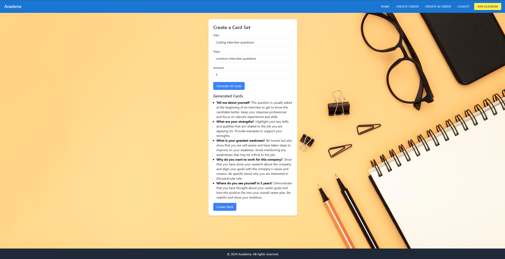
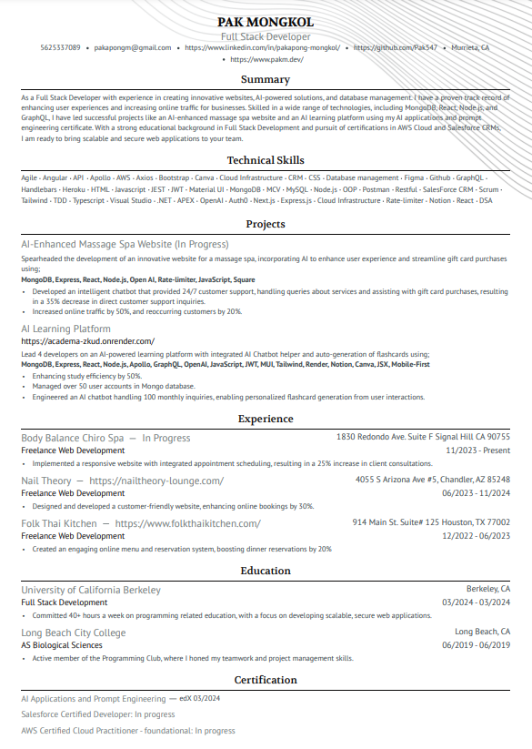

# pakdev

Pak Mongkol
Full Stack Developer | MERN Specialist | AI Prompter | Web Developer 
Hello! I'm Pak Mongkol, a Full Stack Developer deeply passionate about crafting dynamic web applications and innovative solutions using the MERN stack (MongoDB, Express, React, Node.js). My journey in technology is driven by a relentless pursuit of learning, a passion for solving complex challenges, and a commitment to excellence.

What I Do
Web Development: Specialize in building responsive and scalable web applications using the MERN stack.
Modern JavaScript Libraries/Frameworks: Utilizing React.js to create intuitive and efficient user interfaces.
Freelance: Created working, scalable websites for local businesses.

Skills
Languages: JavaScript (ES6+), HTML5, CSS3, TypeSCript, .Net, APEX,
Frameworks/Libraries: React.js, Express,
Databases: MongoDB, SQL
Tools & Platforms: Node.js, Git, Github
Interests: Cyber Security, Artificial Intelligence, Data Analysis, AWS Cloud, Salesforce

Certifications
AI Applications and Prompt Engineering - edX
Salesforce Development - In Progress
AWS Cloud Practitioner - In Progress

Recent Projects

https://github.com/Pak547/academa2
https://academa-zkud.onrender.com/

Resume

[Download my resume!](<src/Assets/Pakapong's Resume.pdf>)

Let's Connect
I'm always on the lookout for new opportunities and collaborations that challenge me and allow me to put my skills to the test. If you're interested in working together or just want to say hi, feel free to reach out!

LinkedIn: https://www.linkedin.com/in/pakapong-mongkol/
GitHub: https://github.com/Pak547
Portfolio: https://www.pakm.dev/

## Credits
Template from Soumyajit4419
https://github.com/Soumyajit4419
